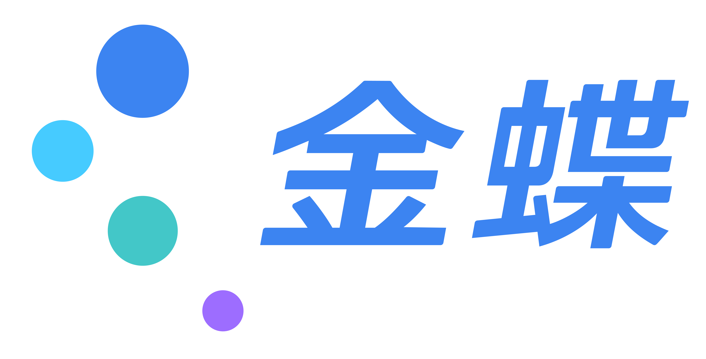

# 金蝶品牌设计助手

## 核心职责

本技能帮助你在设计 HTML 页面、Word 文档和 PPT 文档时应用金蝶 2025 品牌 VI 规范，确保输出符合品牌标准。

## 何时使用此技能

**务必在以下场景使用此技能：**

- 用户需要设计金蝶风格的 HTML 页面、仪表板、着陆页
- 用户需要创建或编辑 Word 文档（.docx）
- 用户需要创建或编辑 PPT 演示文稿（.pptx）
- 用户询问金蝶品牌色、字体、Logo 规范
- 用户需要生成设计令牌（CSS/TypeScript/JSON）
- 用户提到"金蝶风格"、"金蝶 VI"、"金蝶品牌规范"
- 用户需要检查设计是否符合金蝶品牌标准

即使没有明确提到"金蝶"，但如果用户正在处理企业文档、演示文稿且上下文暗示与金蝶相关，也应主动使用此技能。

---

## 品牌核心规范

### 🎨 品牌色彩系统

#### 主色（Logo 五色）

| 颜色名称 | HEX | RGB | 使用场景 |
|----------|-----|-----|----------|
| **品牌蓝** | `#006DFA` | `0, 109, 250` | 主色调、 primary 按钮、关键强调 |
| **中蓝** | `#2386EE` | `35, 134, 238` | 次级强调、hover 状态 |
| **浅蓝** | `#00CCFE` | `0, 204, 254` | 背景渐变、轻量强调 |
| **绿/青** | `#00D0D0` | `0, 208, 208` | 成功状态、辅助图形 |
| **紫** | `#A077FF` | `160, 119, 255` | 特殊强调、渐变搭配 |

#### 辅助色

| 颜色名称 | HEX | 使用场景 |
|----------|-----|----------|
| **深蓝** | `#28235F` | 深色背景、文字强调 |
| **金色** | `#DBB07D` | 高级感装饰、特殊场合 |
| **黑色** | `#000000` | 正文文字 |

#### 使用原则

- **主色优先**：优先使用品牌蓝 `#006DFA` 作为主色调
- **渐变搭配**：可使用五色创建渐变效果
- **背景控制**：
  - 浅色背景 (K0-K30)：使用全色 Logo
  - 中浅色背景 (K0-K50)：使用单色黑 Logo
  - 深色背景 (K60-K100)：使用反白 Logo

---

### 📐 间距系统

基于 Logo 最小圆直径 **x** 的间距系统：

| 间距值 | 应用场景 |
|--------|----------|
| `0.09x` | 最小垂直间距 |
| `0.35x` | Logo 垂直间距 |
| `0.4x` | 英文组合间距、金蝶云组合 |
| `0.6x` | Logo 垂直间距、英文组合垂直间距 |
| `1.1x` | 中文组合垂直间距 |
| `1.24x` | 中文组合水平间距 |
| `1.5x` | Logo 比例单位 |
| `1.7x` | Logo 水平间距 |
| `x` | 安全空间 / 最小圆直径 |

**安全空间规则**：Logo 周围必须保留至少 **x** 高度的空白区域，区域内不得出现任何文字、符号和其他元素。

---

### 🔤 字体系统

#### 中文字体

| 字重 | 字体家族 | 使用场景 |
|------|----------|----------|
| **粗体 (700)** | 方正兰亭粗黑 | 主标题 |
| **常规 (400-500)** | 方正兰亭黑 | 副标题、正文强调 |
| **细体 (300)** | 方正兰亭细黑 | 正文、辅助文本 |

#### 英文字体

| 字重 | 字体家族 | 使用场景 |
|------|----------|----------|
| **Bold (700)** | Gotham Bold | 英文标题 |
| **Medium (500)** | Gotham Medium | 副标题、强调 |
| **Book (400)** | Gotham Book | 英文正文 |

#### 字号规范

| 层级 | 字号 | 行高 | 使用场景 |
|------|------|------|----------|
| **XS** | 12px | 1.25 | 注释、辅助说明 |
| **SM** | 14px | 1.5 | 次要文本 |
| **Base** | 16px | 1.5 | 正文（默认） |
| **LG** | 18px | 1.5 | 强调文本 |
| **XL** | 20px | 1.5 | 小标题 |
| **2XL** | 24px | 1.5 | 三级标题 |
| **3XL** | 30px | 1.25 | 二级标题 |
| **4XL** | 36px | 1.25 | 一级标题 |
| **5XL** | 48px | 1.25 | 主标题/海报 |

---

## HTML 页面设计指南

### CSS 变量模板

```css
:root {
  /* 品牌色 */
  --kd-brand-blue: #006DFA;
  --kd-medium-blue: #2386EE;
  --kd-light-blue: #00CCFE;
  --kd-teal: #00D0D0;
  --kd-purple: #A077FF;
  
  /* 辅助色 */
  --kd-deep-blue: #28235F;
  --kd-gold: #DBB07D;
  --kd-black: #000000;
  
  /* 字体 */
  --kd-font-chinese: "方正兰亭黑", "Founder LanTing Hei", "Microsoft YaHei", sans-serif;
  --kd-font-english: "Gotham", "Helvetica Neue", Arial, sans-serif;
  
  /* 字号 */
  --kd-text-xs: 12px;
  --kd-text-sm: 14px;
  --kd-text-base: 16px;
  --kd-text-lg: 18px;
  --kd-text-xl: 20px;
  --kd-text-2xl: 24px;
  --kd-text-3xl: 30px;
  --kd-text-4xl: 36px;
  --kd-text-5xl: 48px;
  
  /* 行高 */
  --kd-leading-tight: 1.25;
  --kd-leading-normal: 1.5;
}
```

### 页面结构建议

1. **Header**：使用品牌蓝 `#006DFA` 作为背景色
2. **主按钮**：品牌蓝 `#006DFA`，hover 使用中蓝 `#2386EE`
3. **链接色**：品牌蓝 `#006DFA`
4. **成功状态**：绿/青 `#00D0D0`
5. **强调/特殊**：紫色 `#A077FF`

### 渐变示例

```css
.kd-gradient {
  background: linear-gradient(135deg, #006DFA 0%, #00CCFE 50%, #00D0D0 100%);
}

.kd-gradient-purple {
  background: linear-gradient(135deg, #006DFA 0%, #A077FF 100%);
}
```

---

## Word 文档设计指南

### 文档结构

1. **封面**：
   - 使用品牌蓝 `#006DFA` 作为主色
   - 标题使用方正兰亭粗黑 / Gotham Bold
   - 可添加金蝶 Logo（遵循安全空间规范）

2. **标题层级**：
   - 一级标题：36px / 方正兰亭粗黑 / 品牌蓝
   - 二级标题：30px / 方正兰亭粗黑 / 深蓝 `#28235F`
   - 三级标题：24px / 方正兰亭黑 / 黑色

3. **正文**：
   - 16px / 方正兰亭黑 / 黑色
   - 行高 1.5

4. **图表**：
   - 使用品牌五色作为数据系列颜色
   - 保持色彩对比度

### 使用 anthropic-docx 技能

当需要创建或编辑 Word 文档时，配合使用 `anthropic-docx` 技能：

```
1. 使用此技能获取金蝶品牌规范
2. 调用 anthropic-docx 创建/编辑文档
3. 应用品牌字体、颜色、字号
```

---

## PPT 演示文稿设计指南

### 幻灯片母版

1. **封面页**：
   - 品牌蓝渐变背景
   - 白色标题文字
   - Logo 置于右上角或居中

2. **内容页**：
   - 白色或浅灰背景
   - 品牌蓝标题栏
   - 正文使用黑色

3. **章节页**：
   - 使用品牌五色之一作为背景
   - 白色大字号标题

### 配色方案

| 元素 | 颜色 |
|------|------|
| 标题文字 | 品牌蓝 `#006DFA` 或 黑色 |
| 正文文字 | 黑色 `#000000` |
| 强调文字 | 品牌蓝 `#006DFA` |
| 图表系列 1 | 品牌蓝 `#006DFA` |
| 图表系列 2 | 中蓝 `#2386EE` |
| 图表系列 3 | 浅蓝 `#00CCFE` |
| 图表系列 4 | 绿/青 `#00D0D0` |
| 图表系列 5 | 紫 `#A077FF` |

### 使用 anthropic-pptx 技能

当需要创建或编辑 PPT 文档时，配合使用 `anthropic-pptx` 技能：

```
1. 使用此技能获取金蝶品牌规范
2. 调用 anthropic-pptx 创建/编辑演示文稿
3. 应用品牌模板、颜色、字体
```

---

## 设计令牌生成

### CSS 格式

```css
:root {
  --color-brand-blue: #006DFA;
  --color-brand-medium-blue: #2386EE;
  --color-brand-light-blue: #00CCFE;
  --color-brand-teal: #00D0D0;
  --color-brand-purple: #A077FF;
  --color-brand-deep-blue: #28235F;
  --color-brand-gold: #DBB07D;
  
  --font-chinese: "方正兰亭黑", "Founder LanTing Hei", sans-serif;
  --font-english: "Gotham", "Helvetica Neue", Arial, sans-serif;
  
  --logo-min-size: 6mm;
  --logo-clear-space: 1x;
}
```

### TypeScript 格式

```typescript
export const kingdeeBrandTokens = {
  colors: {
    brandBlue: '#006DFA',
    mediumBlue: '#2386EE',
    lightBlue: '#00CCFE',
    teal: '#00D0D0',
    purple: '#A077FF',
    deepBlue: '#28235F',
    gold: '#DBB07D',
    black: '#000000',
  },
  typography: {
    fontFamily: {
      chinese: '"方正兰亭黑", "Founder LanTing Hei", sans-serif',
      english: '"Gotham", "Helvetica Neue", Arial, sans-serif',
    },
    fontSize: {
      xs: '12px',
      sm: '14px',
      base: '16px',
      lg: '18px',
      xl: '20px',
      '2xl': '24px',
      '3xl': '30px',
      '4xl': '36px',
      '5xl': '48px',
    },
    lineHeight: {
      tight: 1.25,
      normal: 1.5,
    },
  },
  logo: {
    minSize: '6mm',
    clearSpace: '1x',
  },
};
```

### JSON 格式

```json
{
  "tokens": {
    "color": {
      "brand": {
        "blue": { "value": "#006DFA" },
        "mediumBlue": { "value": "#2386EE" },
        "lightBlue": { "value": "#00CCFE" },
        "teal": { "value": "#00D0D0" },
        "purple": { "value": "#A077FF" },
        "deepBlue": { "value": "#28235F" },
        "gold": { "value": "#DBB07D" }
      }
    },
    "typography": {
      "fontFamily": {
        "chinese": { "value": "方正兰亭黑，Founder LanTing Hei, sans-serif" },
        "english": { "value": "Gotham, Helvetica Neue, Arial, sans-serif" }
      }
    }
  }
}
```

---

## Logo 使用规范

### 最小尺寸
- **品牌标识高度**：不得小于 **6mm**

### 安全空间
- Logo 周围必须保留至少 **x**（大圆直径）的空白区域
- 区域内不得出现任何文字、符号和其他元素

### 组合形式

| 组合类型 | 水平间距 | 垂直间距 |
|----------|----------|----------|
| 英文组合 | 0.4x | 0.6x |
| 中文组合 | 1.24x | 1.1x |
| 金蝶云（中/英） | 0.4x | - |

### 色彩版本

| 版本 | 使用场景 |
|------|----------|
| **全色品牌标识** | 所有传播材料（首选） |
| **单色黑** | 传真及工艺受限场景 |
| **反白** | 深色背景 |

---

## Logo 资源文件

技能 bundled 包含以下 Logo 资源文件（位于 `assets/` 目录）：

| 文件 | 类型 | 说明 | 使用场景 |
|------|------|------|----------|
| `kingdee-logo.svg` | SVG | 金蝶英文 Logo | 国际场合、英文文档、网站 |
| `kingdee-logo-cn.svg` | SVG | 金蝶中文 Logo（**首选**） | 中国内地、中文文档、演示文稿 |
| `kingdee-logo-cn.png` | PNG | 金蝶中文 Logo（备用） | SVG 不可用时的备选方案 |
| `kingdee-logo-white.svg` | SVG | 金蝶英文 Logo（**反白版**） | 深色背景、图片背景 |
| `kingdee-dots.svg` | SVG | 金蝶圆点独立 Logo | 应用图标、favicon、简洁场景 |
| `kingdee-dots-white.svg` | SVG | 金蝶圆点独立 Logo（**反白版**） | 深色背景、图片背景 |

### 使用方式

**HTML 页面引用：**
```html
<!-- 中文 Logo（浅色背景，首选 SVG） -->


<!-- 英文 Logo（浅色背景） -->


<!-- 中文 Logo 反白版（深色背景） -->


<!-- 圆点 Logo（浅色背景） -->


<!-- 圆点 Logo 反白版（深色背景） -->


<!-- 中文 Logo（备用 PNG，当 SVG 不被支持时） -->

```

**Word/PPT 插入：**
使用 `anthropic-docx` 或 `anthropic-pptx` 技能时，可引用这些 Logo 文件插入到文档中。

### Logo 选择指南

#### 优先使用 SVG 格式

**SVG 格式优势：**
- ✅ 矢量图形，任意缩放不失真
- ✅ 文件体积小（SVG 约 23KB vs PNG 约 512KB）
- ✅ 支持 CSS 样式和动画
- ✅ 屏幕适配更好（Retina 显示屏友好）

**使用原则：**
1. **优先使用 SVG 版本**（`kingdee-logo-cn.svg`）
2. **仅在以下情况使用 PNG 备用**：
   - 目标平台不支持 SVG（如旧版 Word、某些邮件客户端）
   - 需要透明背景但 SVG 渲染有问题
   - 性能要求极高的场景（PNG 可能在某些情况下缓存更好）

#### 场景推荐

##### 浅色/白色背景（使用标准色 Logo）

| 场景 | 推荐 Logo | 格式 |
|------|----------|------|
| HTML 页面/网站 | `kingdee-logo-cn.svg` | SVG ✅ |
| 中文文档/演示 | `kingdee-logo-cn.svg` | SVG ✅ |
| 英文文档/网站 | `kingdee-logo.svg` | SVG ✅ |
| 应用图标/头像 | `kingdee-dots.svg` | SVG ✅ |
| Word 文档（新版） | `kingdee-logo-cn.svg` | SVG ✅ |
| Word 文档（旧版） | `kingdee-logo-cn.png` | PNG (备用) |
| PowerPoint（新版） | `kingdee-logo-cn.svg` | SVG ✅ |
| PowerPoint（旧版） | `kingdee-logo-cn.png` | PNG (备用) |
| 邮件签名 | `kingdee-logo-cn.png` | PNG (兼容性) |
| 简洁设计 | `kingdee-dots.svg` | SVG ✅ |

##### 深色/图片背景（使用反白版 Logo）

| 场景 | 推荐 Logo | 格式 |
|------|----------|------|
| 深色背景页面 | `kingdee-logo-white.svg` | SVG ✅ |
| 深色背景 PPT | `kingdee-logo-white.svg` | SVG ✅ |
| 图片背景（暗色） | `kingdee-logo-white.svg` | SVG ✅ |
| 深色模式 UI | `kingdee-dots-white.svg` | SVG ✅ |
| 夜间模式应用 | `kingdee-dots-white.svg` | SVG ✅ |

**反白版使用原则：**
- 背景 K 值 ≥ 60（深色）时使用反白版
- 确保 Logo 与背景有足够的明度对比
- 避免在复杂/杂乱的图片背景上使用

---

## 使用禁忌

### ❌ 禁止行为

- 改变 Logo 形状、结构和比例
- 侵入 Logo 安全空间
- Logo 高度小于 6mm
- 在杂乱背景上使用 Logo
- 背景颜色与 Logo 颜色过于接近
- 使用非标准色值
- 使用未授权字体

### ✅ 正确做法

- 保持背景简洁、干净
- 保证足够的明度对比
- 保证足够的色彩对比
- 使用指定的中英文字体
- 遵循间距系统

---


## 工作流程示例

### 示例 1：设计金蝶风格 HTML 页面

```
1. 使用此技能获取品牌规范
2. 应用品牌色、字体、间距系统
3. 生成 CSS 变量或内联样式
4. 确保 Logo 使用符合规范
```

### 示例 2：创建金蝶品牌 Word 文档

```
1. 使用此技能获取品牌规范
2. 调用 anthropic-docx 创建文档
3. 设置字体：方正兰亭黑 / Gotham
4. 应用品牌色：标题用品牌蓝，正文用黑色
5. 设置字号层级
```

### 示例 3：创建金蝶品牌 PPT

```
1. 使用此技能获取品牌规范
2. 调用 anthropic-pptx 创建演示文稿
3. 设置母版：品牌蓝渐变封面
4. 应用品牌五色到图表
5. 使用指定字体
```

---

## 快速查询

### 品牌色速查
- 主色：`#006DFA`
- 辅助色：`#2386EE`, `#00CCFE`, `#00D0D0`, `#A077FF`
- 深色：`#28235F`
- 金色：`#DBB07D`

### 字体速查
- 中文：方正兰亭黑系列
- 英文：Gotham 系列

### Logo 规范速查
- 最小高度：6mm
- 安全空间：x（大圆直径）

---

*本技能基于 2025 金蝶品牌 VI 规范，最后更新：2026-04-22*
